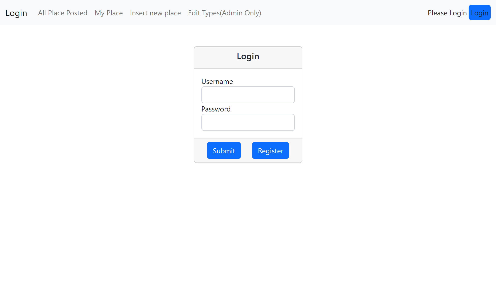
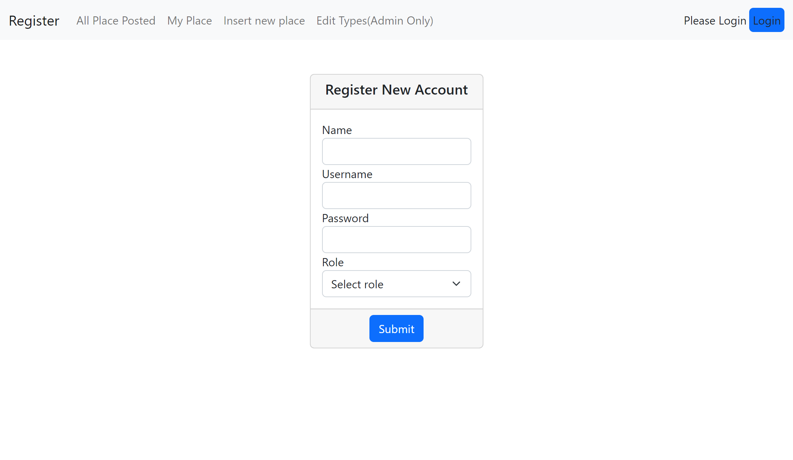
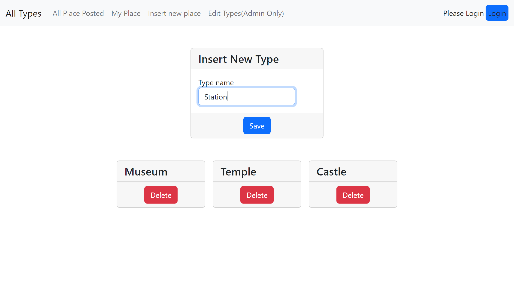
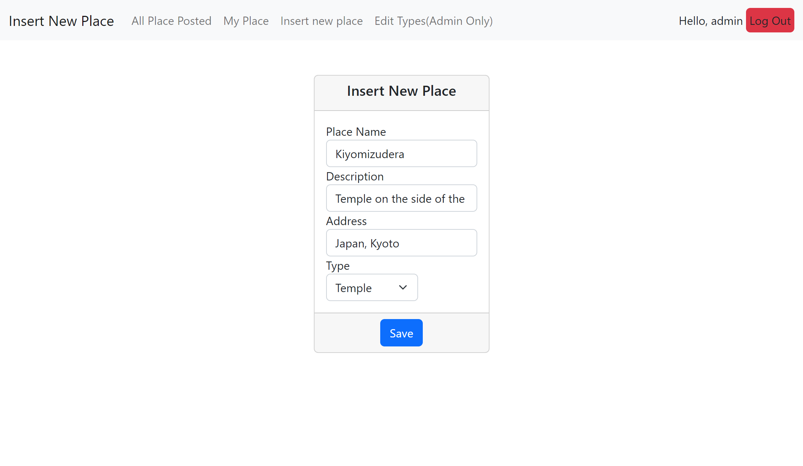
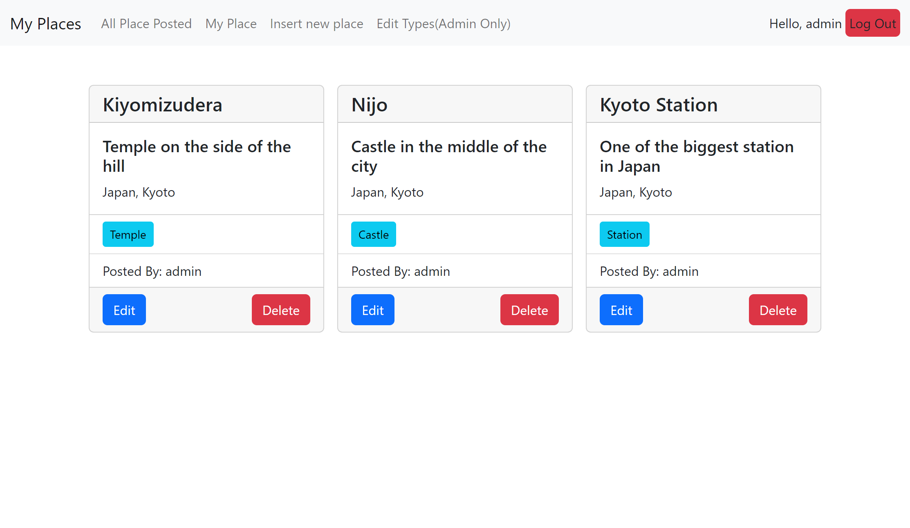
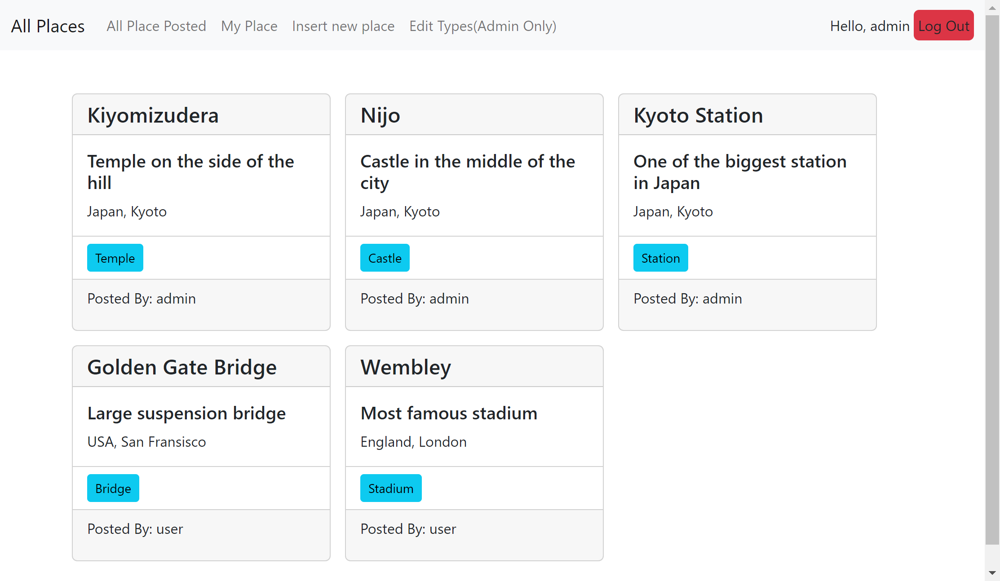
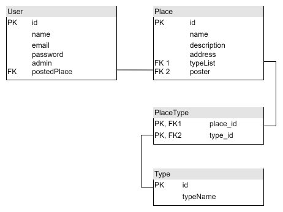

# Introduction

This is a Final Project of the class Web Programming created by Glenaldy.

The application provides functionality of admin/user Sign Up, place 'object' posting with the user ownership and the place type tagging.

To start, register new user through http://localhost:8080/register/, login and start posting places!

Application on http://localhost:8080/

### Tech stack:
- Kotlin
- Spring Boot
- JPA (HQL)
- REST API
- Bootstrap

This spring boot project is created based on the ``Layered Architecture`` approach.
> 1st Layer: Entity (Place, Type, User)

> 2nd Layer: Repository (PlaceRepository, TypeRepository, UserRepository)

> 3rd Layer: Service (PlaceService, TypeService, UserService)

> 4th Layer: Controller (RestController, ViewController)

Each layer provides data to the next layer or below. This ensures data will always be sanitized into the database or when
served to the user.

---

# Images of the application

## `Login Page` http://localhost:8080/login



## `Register Page` http://localhost:8080/register



## `Insert new type (ADMIN only)` http://localhost:8080/admin/types



## ``Insert new place form`` http://localhost:8080/insert_place



## `My Places` http://localhost:8080/show_mine



## `All places posted by other user` http://localhost:8080/show_all


---

# Database

## PostgresSQL

The postgres database is connected through Hibernate Query Language with the entity.



Relation:<br>
User `One To Many` Place <br>
Place `Many To Many` Type

Database Connection

- ``URL`` jdbc:postgresql://localhost:5432/web3Final
- ``username`` postgres
- ``password`` password

---

# Entity

## User

Custom User object that stores the user data in the database and their authority

```kotlin
class User(
        val id: Long?
        var name: String
        var email: String
        var password: String
        var admin: Boolean
        val postedPlace: MutableList<Place>
)
```

postedPlace is related to the Place

## Place

Place object storing information of a place and the poster(user) name.

```kotlin
class Place(
        val id: Long?
        var name: String
        var description: String
        var address: String
        var typeList: MutableList<Type>
        var poster: User
)
```

typeList is related to Type
poster is related to the User

## Type

Stores the type of the place (castle, temple, museum, etc.)

```kotlin
class Place(
        val id: Long?
        var typeName: String
        var placeList: MutableSet<Place>
)
```

placeList is related to Place

---

# Spring Security & API Dovumentation

## REST API

A better documentation can be accessed through http://localhost:8080/swagger-ui.html
Login is needed.

# `PLACE`

Authentication: ONLY ``ADMIN & USER``

## ``GET``

### ``GET all`` http://localhost:8080/api/place

- ``Return`` HTTP Status with JSON of all the Place object(s).

### ``Get all place by poster`` http://localhost:8080/api/place/mine

- ``Return`` HTTP Status with JSON of all the Place object(s) the authenticated user posted.

### ``Get place by id`` http://localhost:8080/api/place/{id}

- ``Param`` Integer ``id`` ID of the specified object.
- ``Return`` HTTP Status with JSON of the Place object if the authenticated user is the one who posted it.

## ``POST``

### http://localhost:8080/api/place

- ``Return`` HTTP Status with the inserted Place from the database
- The poster is specified from the authentication
- ``Sample request body``

```json
{
  "name": "Kiyomizudera",
  "description": "Temple on the hillside",
  "address": "Japan, Kyoto",
  "typeList": [
    1
  ]
}
```

## ``PUT``

### http://localhost:8080/api/place

- ``Return`` HTTP Status with the updated Place from the database
- Can only edit if the poster and the authorized or admin is the same
- ``Sample request body``

```json
{
  "id": 1,
  "name": "Update Kiyomizudera",
  "description": "Temple on the hillside",
  "address": "Japan, Kyoto",
  "typeList": [
    2
  ]
}
```

## ``Delete``

### ``Delete by id`` - ``Param`` Integer ``id`` ID of the specified object.

- ``Return`` HTTP Status with deleted JSON of the Place object if found.

# `Type`

Authentication: ``ADMIN & USER``

## ``GET``

### ``GET all`` http://localhost:8080/api/place-type

- ``Return`` HTTP Status with JSON of all the Type object(s).

### ``Get type by id`` http://localhost:8080/api/place-type/{id}

- ``Param`` Integer ``id`` ID of the specified object.
- ``Return`` HTTP Status with JSON of the Type object if found.

## ``POST``

### http://localhost:8080/api/place-type/

- ``Return`` HTTP Status with the inserted Type from the database
- ``Sample request body``

```json
{
  "typeName": "Temple"
}
```

## ``Delete``

### ``Delete by id``

- ``Param`` Integer ``id`` ID of the specified object.

- ``Return`` HTTP Status with deleted JSON of the Place object if found.

# `User`

Authentication: ``ADMIN & USER``

## ``GET``

### ``GET all`` http://localhost:8080/api/user

- ``Return`` HTTP Status with JSON of all the User(s).

### ``Get current user`` http://localhost:8080/api/user

- Get the User details of the authenticated user

- ``Return`` HTTP Status with JSON of the User object if found.

---

# View Authentication

### ``No-Auth`` Public page

> Get

These are the page used to log in, register or log out. No Authentication is needed.

- ``Get`` Index(redirect to login or home) http://localhost:8080/
- ``Get`` Login Page http://localhost:8080/login
- ``Post`` Login form receiver http://localhost:8080/login
- ``Get`` Register Page http://localhost:8080/register
- ``Post`` Register form receiver http://localhost:8080/register
- ``Get`` Log out(redirect to login) http://localhost:8080/logout

### ``ADMIN, USER`` Authenticated user only

All of these should only be accessed by authorized user.
> Get, Post

- ``Get`` Show all places http://localhost:8080/show_all
- ``Get`` Show all places by the user http://localhost:8080/show_mine
- ``Get`` Form to insert new place http://localhost:8080/insert_place
- ``Get`` Form to edit a place http://localhost:8080/edit_place/{id}
- ``Post`` Post request to edit place, can only edit place owned by the poster http://localhost:8080/edit_place
- ``Post`` Post to delete place, can only delete place owned by the poster http://localhost:8080/delete_place

### ``ADMIN`` Admin only page

Types are accessible by all users to add to their Place(s). To prevent bad actor from adding/deleting types, only admin
can add or delete Type.
> Get, Post

- ``Get`` Show all the types http://localhost:8080/admin/types
- ``Post``Delete a type http://localhost:8080/admin/admin/delete_type
- ``Post``Insert type http://localhost:8080/admin/admin/insert_type

---

